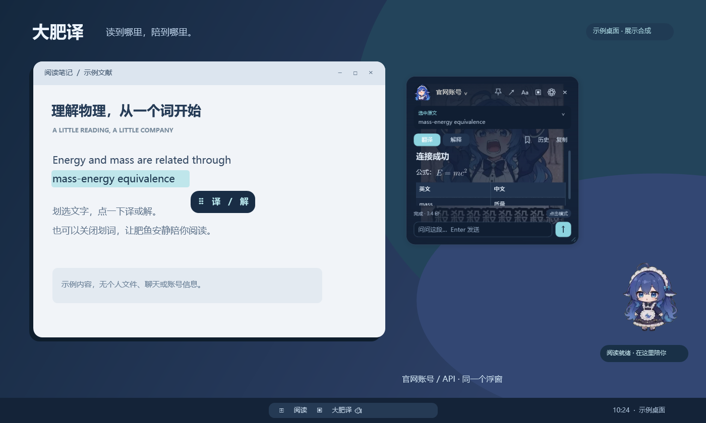
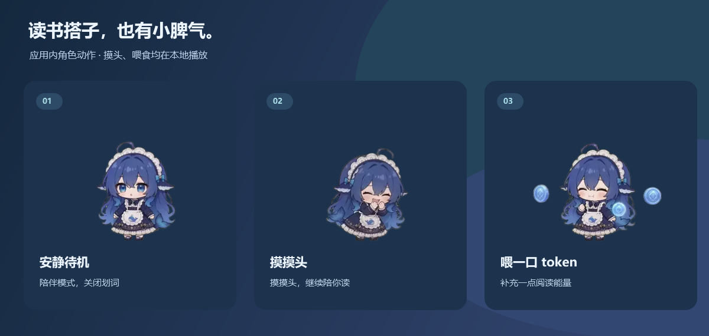
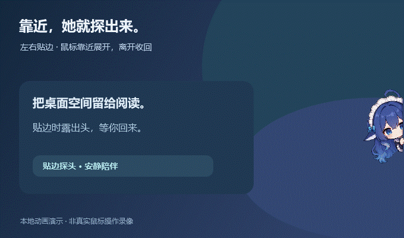
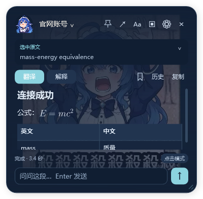

# 大肥译 🐟

**简体中文** | [English](README.en.md)

陪你读文献、查词和理解公式的 Windows 悬浮翻译工具。选中文字，点击小按钮翻译或解释；也可以选择自动翻译、剪贴板识别或只让肥鱼陪着。

## 桌面上的肥鱼

她可以安静待在桌面，也可以摸摸头、喂一口 token。只想让她陪着？右键选择 **仅陪伴 · 关闭划词**。

拖到屏幕左边或右边，她会收起身子、露出头；鼠标靠近时连续展开，离开后再收回。

展示使用本版本的角色图集、贴边动画逻辑和浮窗截图，在干净的示例桌面中合成；不含个人桌面或账号信息。互动在本地播放，不请求模型、不消耗 API。

看看翻译浮窗的细节

官网账号与 API 的回答都显示在同一个浮窗，支持 Markdown 表格与数学公式。

## 下载与使用

1. 到 [最新版本](https://github.com/gary1110086/dafeiyi/releases/latest) 下载 **DaFeiYi-Windows-x64-v1.0.0.zip**，完整解压到一个文件夹。
2. 双击 **轻译.exe** 即可运行。想放到桌面，双击 **安装到桌面.cmd**；需要开机启动，选择 **安装并开机启动.cmd**。
3. 设置里选择连接：**官网账号**登录自己的 DeepSeek 账号后返回浮窗，或 **API**填写自己的 API Key。
4. 划选一段文字，点击「翻译 / 解释」。官网和 API 回答都逐步显示在同一个肥鱼浮窗。

支持 Windows 10/11 x64、.NET Framework 4.8。官网模式需要 [Microsoft Edge WebView2 Runtime](https://developer.microsoft.com/microsoft-edge/webview2/)；较新的 Windows/Edge 通常已安装。没有 Python、Node 或 Electron 依赖。

## 功能

- 点击、自动、剪贴板翻译、仅陪伴四种模式；小按钮有独立拖柄。
- 官网账号与 API 两种连接，快速回答与深度思考可切换。
- Markdown 标题、列表、代码、表格和 LaTeX 公式本机排版。
- 可拖动、缩放、固定的浮窗；未固定时点击其他软件收起，生成中关闭会取消。
- 根据当前段落追问，最近 30 条完成记录，术语收藏、个人笔记与常用译法。
- 两张内置背景、自选背景、字号与行距调整。
- 肥鱼的摸头、摆尾、喂食、拖动、左右贴边探头及连续动画；这些互动不请求模型。

|快捷键|用途|
|---|---|
|Ctrl + Alt + D|读取选区；不支持时尝试复制|
|Ctrl + Alt + V|翻译已经复制的文字|
|Ctrl + Alt + S|屏幕识字，框选图片或 PDF 中的文字|
|Esc|收起结果|
|Ctrl + E|切换紧凑 / 展开|

普通划词依赖软件是否暴露选区；读不到时用复制或屏幕识字。OCR 结果可修改，公式或多栏文字可能识别有误。

## 隐私与连接

**发行包不含开发者的 API Key、登录会话、个人设置、历史、收藏或自选背景。每个人使用自己的账户。**

- 个人数据保存在本机 `%LOCALAPPDATA%/LightTranslate/`，API Key、历史与术语由 Windows 当前用户加密。
- 官网登录使用独立 WebView2 profile。应用不读取账号密码、不导出 Cookie；验证码由你在官网完成。
- 请求只提交待处理文字及当前追问上下文；截图在本机 OCR，不上传整屏图片。
- 自动 / 剪贴板模式会发送相应文字，请按使用场景选择；API 消费计入你自己的账户。
- 官网模式通过网页会话工作，网页改版可能需要适配。失败不会自动切换到收费 API。

本项目是非官方工具，与 DeepSeek 无隶属关系。

## 构建与验证

下载源码后，在源码目录运行 `powershell -NoProfile -ExecutionPolicy Bypass -File .\build.ps1`。
构建使用 Windows 自带 Framework csc；依赖、字体、图集和许可已包含。
运行 `verify.ps1` 做本地验证。验证使用本地模拟服务，不需要真实 API Key；测试会短暂创建窗口和移动鼠标。
真实官网账号测试是显式 `--web-connect-test <目录>`，会向你自己的官网账号发送短测试问题，不在常规验证中自动执行。

## 许可

代码使用 [MIT](LICENSE)；第三方动画、字体和 DLL 保留各自许可，见 [第三方说明](THIRD_PARTY_NOTICES.md)。内置背景随本版本分享，不因此转为代码 MIT 许可。人物及商标相关权利归相应权利人。

## 动画来源与致谢

大肥译的桌面肥鱼动画参考了 **DeepSeek Harness 的 dafeiyu 桌宠插件**，并使用了其所采用的 [dsh-pet](https://github.com/PC2005-cloud/dsh-pet) 动画素材。在此基础上，我们适配了桌面陪伴、翻译状态反馈、摸头与喂食互动，以及左右贴边探头等使用场景。

感谢原项目作者和素材创作者，让这只可爱的肥鱼能够陪伴更多人的阅读与学习。相关素材保留原有版权和许可，详见 [动画素材说明](Assets/Whale/ASSET_LICENSE.md)。本项目为独立开发的非官方工具，与 DeepSeek、DeepSeek Harness 及相关原项目不存在官方隶属或合作关系。
